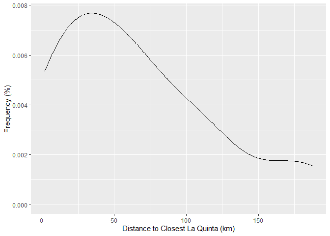

Lab 04 - La Quinta is Spanish for next to Denny’s, Pt. 2
================
Mr. Ryan Wheat
2/21/23

### Load packages and data

``` r
library(tidyverse) 
library(dsbox) 
library(psych)
```

``` r
states <- read_csv("data/states.csv")
dn <- dennys
lq <- laquinta
```

### Exercise 1

There are 3 Dennys locations in Alaska.

``` r
dn_ak <- dn %>%
  filter(state == "AK")
nrow(dn_ak)
```

    ## [1] 3

### Exercise 2

There are two La Quinta locations in Alaska.

``` r
lq_ak <- lq %>%
  filter(state == "AK")
nrow(lq_ak)
```

    ## [1] 2

### Exercise 3

We need to calculate six distances, because there are six combinations
of distances between each Denny’s and La Quinta location in Alaska.

### Exercise 4

There are 6 observations in this dataframe, which match the six
combinations we needed. The names of the variables seem to indicate
which dataframe they come from – .x = dn_ak; .y = lq_ak.

``` r
dn_lq_ak <- full_join(dn_ak, lq_ak, by = "state")
dn_lq_ak
```

    ## # A tibble: 6 × 11
    ##   address.x      city.x state zip.x longi…¹ latit…² addre…³ city.y zip.y longi…⁴
    ##   <chr>          <chr>  <chr> <chr>   <dbl>   <dbl> <chr>   <chr>  <chr>   <dbl>
    ## 1 2900 Denali    Ancho… AK    99503   -150.    61.2 3501 M… "\nAn… 99503   -150.
    ## 2 2900 Denali    Ancho… AK    99503   -150.    61.2 4920 D… "\nFa… 99709   -148.
    ## 3 3850 Debarr R… Ancho… AK    99508   -150.    61.2 3501 M… "\nAn… 99503   -150.
    ## 4 3850 Debarr R… Ancho… AK    99508   -150.    61.2 4920 D… "\nFa… 99709   -148.
    ## 5 1929 Airport … Fairb… AK    99701   -148.    64.8 3501 M… "\nAn… 99503   -150.
    ## 6 1929 Airport … Fairb… AK    99701   -148.    64.8 4920 D… "\nFa… 99709   -148.
    ## # … with 1 more variable: latitude.y <dbl>, and abbreviated variable names
    ## #   ¹​longitude.x, ²​latitude.x, ³​address.y, ⁴​longitude.y

### Exercise 5

mutate() is the function that will create a new variable while keeping
our current variables I think?

### Exercise 6

``` r
#create haversine function

haversine <- function(long1, lat1, long2, lat2, round = 3) {
  # convert to radians
  long1 = long1 * pi / 180
  lat1  = lat1  * pi / 180
  long2 = long2 * pi / 180
  lat2  = lat2  * pi / 180
  
  R = 6371 # Earth mean radius in km
  
  a = sin((lat2 - lat1)/2)^2 + cos(lat1) * cos(lat2) * sin((long2 - long1)/2)^2
  d = R * 2 * asin(sqrt(a))
  
  return( round(d,round) ) # distance in km
}

#create new variable "distance"

dn_lq_ak <- dn_lq_ak %>%
  mutate(distance = haversine(dn_lq_ak$longitude.x, dn_lq_ak$latitude.x, dn_lq_ak$longitude.y, dn_lq_ak$latitude.y))
```

### Exercise 7

``` r
dn_lq_ak_mindist <- dn_lq_ak %>%
  group_by(address.x) %>%
  summarize(closest = min(distance))
```

### Exercise 8

On average, the closest La Quinta to each Dennys location (in Alaska) is
4.41 km away. There is not much variance in these distances – the SD is
2.1 km among these scores.

``` r
ggplot(data = dn_lq_ak_mindist,
       mapping = aes(x = address.x, y = closest)) +
  geom_point(color = "red") + 
  labs(x = "Dennys Location", y = "Distance to Closest La Quinta (km)")
```

<!-- -->

``` r
summary(dn_lq_ak_mindist, closest)
```

    ##   address.x            closest     
    ##  Length:3           Min.   :2.035  
    ##  Class :character   1st Qu.:3.616  
    ##  Mode  :character   Median :5.197  
    ##                     Mean   :4.410  
    ##                     3rd Qu.:5.598  
    ##                     Max.   :5.998

``` r
describe(dn_lq_ak_mindist)
```

    ##            vars n mean  sd median trimmed  mad  min max range  skew kurtosis
    ## address.x*    1 3 2.00 1.0    2.0    2.00 1.48 1.00   3  2.00  0.00    -2.33
    ## closest       2 3 4.41 2.1    5.2    4.41 1.19 2.04   6  3.96 -0.32    -2.33
    ##              se
    ## address.x* 0.58
    ## closest    1.21

### Exercise 9

Dennys and La Quinta locations are further from each other in NC – on
average, the closest distance between them is 65.44 km, and there is
more variance in the distribution of these distances as well (SD =
53.42).

``` r
#filtering for Dennys & La Quinta NC locations

dn_nc <- dn %>%
  filter(state == "NC")

lq_nc <- lq %>%
  filter(state == "NC")

#join datasets so that both info is in one file

dn_lq_nc <- full_join(dn_nc, lq_nc, by = "state")

#create new variable "distance"

dn_lq_nc <- dn_lq_nc %>%
  mutate(distance = haversine(dn_lq_nc$longitude.x, dn_lq_nc$latitude.x, dn_lq_nc$longitude.y, dn_lq_nc$latitude.y))

#calculate minimum distance for each location

dn_lq_nc_mindist <- dn_lq_nc %>%
  group_by(address.x) %>%
  summarize(closest = min(distance))

#visualize and summarize minimum distance between Dennys/La Quinta locations

ggplot(data = dn_lq_nc_mindist,
       mapping = aes(x = closest)) +
  geom_density() + 
  labs(x = "Distance to Closest La Quinta (km)", y = "Frequency")
```

<!-- -->

``` r
summary(dn_lq_nc_mindist, closest)
```

    ##   address.x            closest       
    ##  Length:28          Min.   :  1.779  
    ##  Class :character   1st Qu.: 22.388  
    ##  Mode  :character   Median : 53.456  
    ##                     Mean   : 65.444  
    ##                     3rd Qu.: 93.985  
    ##                     Max.   :187.935

``` r
describe(dn_lq_nc_mindist)
```

    ##            vars  n  mean    sd median trimmed   mad  min    max  range skew
    ## address.x*    1 28 14.50  8.23  14.50   14.50 10.38 1.00  28.00  27.00 0.00
    ## closest       2 28 65.44 53.42  53.46   60.72 51.06 1.78 187.94 186.16 0.81
    ##            kurtosis    se
    ## address.x*    -1.33  1.55
    ## closest       -0.35 10.10

…

Add exercise headings as needed.
